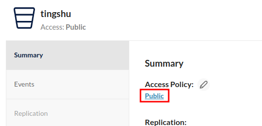
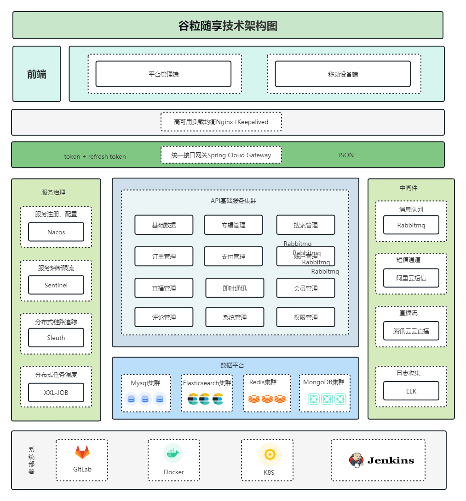

# GettingStart

::: tip
对于基础开发环境，比如 MySQL、Redis 等等，在这里统一使用 Docker 容器，并且使用 docker-compose 进行容器编排。
因此，首先需要具备 docker 和 docker-compose 环境，这里不做赘述，详情参考 [尚硅谷 Docker 实战教程](https://www.bilibili.com/video/BV1gr4y1U7CY/?spm_id_from=333.337.search-card.all.click)

当你运行 docker-compose 文件时，部分镜像可能失效造成容器无法运行，因此你可以将 compose 文件中的镜像根据需求替换
:::

## 本机环境

硬件环境：笔记本（Arch Linux） + 台式机（Windows10），笔记本是Linux系统，负责编码开发以及运行Docker容器，台式机跑微信小程序进行测试。


## Docker 容器

### MySQL
使用图形界面工具，执行 tingshu.sql 即可，里面包含所有的建库建表语句

### RabbitMQ

1. 首先下载 rabbitmq_delayed_message_exchange-3.12.0.ez 文件上传到 RabbitMQ 所在服务器，[下载地址](https://www.rabbitmq.com/community-plugins.html)         
2. 切换到插件所在目录，执行 `docker cp rabbitmq_delayed_message_exchange-3.12.0.ez ts-rabbitmq:/plugins` 命令，将刚插件拷贝到容器内 plugins 目录下
3. 执行 `docker exec -it ts-rabbitmq /bin/bash` 命令进入到容器内部
4. 执行 `cd plugins` 进入 plugins 目录, 然后执行 `ls -l|grep delay` 命令查看插件是否 copy 成功
5. 在容器内 plugins 目录下，执行 `rabbitmq-plugins enable rabbitmq_delayed_message_exchange` 命令启用插件
6. exit 命令退出 RabbitMQ 容器内部，然后执行 `docker restart ts-rabbitmq` 命令重启 RabbitMQ 容器

### Redis
[官网](https://redis.io/docs/latest/operate/oss_and_stack/management/config/) 下载对应版本配置文件，修改以下地方（行数可能不一致）：
- 注释 87 行 `bind 127.0.0.1 -::1`
- 111 行 `protected-mode` 修改为 yes
- 1036 行解开注释，设置密码，比如 `requirepass redis`
- 1379 行 `appendonly` 修改为 no

### Minio
当实现文件上传接口后，获取返回的图片访问地址，无法访问的原因可能是 bucket 的权限未开放，默认权限是 `private`，将其修改为 `public` 即可在浏览器输入地址访问图片



### MongoDB

运行`docker-compose.yml`即可

### Nacos

运行`docker-compose.yml`即可

### Sentinel

运行`docker-compose.yml`即可

### Kafka

运行`docker-compose.yml`即可

### ElasticSearch

参考[官网](https://www.elastic.co/guide/en/elasticsearch/reference/8.14/run-elasticsearch-locally.html)安装即可

## 前端部署

使用自己的邮箱注册[微信小程序](https://mp.weixin.qq.com/wxopen/waregister?action=step1&source=mpregister&token=&lang=en_US)，获取自己的AppId和AppSecret（注意保存好）


下载安装[微信开发者工具](https://developers.weixin.qq.com/miniprogram/dev/devtools/download.html)，将`mp-weixin`导入，注意将AppId换成自己的。在安全中打开服务端口：


如果有需要，自行修改`config/config.js`中的后端接口配置：

```javascript
// 基础请求路径
export const BASE_URL = "http://127.0.0.1:80"
// 基础上传路径
export const BASE_UPLOAD_URL = "http://127.0.0.1:80"
// webSocket基础路径
export const WebSocket_BASE_URL = "ws://127.0.0.1/api/websocket"
```

## 项目背景

随着智能手机和高速互联网的普及，人们开始寻求更便捷的方式来获取信息和娱乐。有声书的出现使得人们可以在旅途中、跑步时、做家务时等各种场景下，以更加灵活的方式享受阅读。

在过去，有声书主要是由专业的演员朗读，制作成录音带或 CD。但随着数字化媒体的发展，听书软件应运而生，为用户提供了更多选择，包括自助出版的有声书和多样化的内容。

意义：

1. 便捷性：听书软件使得阅读不再局限于纸质书籍，用户可以通过手机等设备在任何时间、任何地点收听有声书，节省了携带实体书的麻烦。
2. 多样化内容：听书软件提供了广泛的有声书选择，涵盖了各种类型的图书、小说、杂志、教育内容等。这样的多样性使得用户能够根据个人兴趣和需求选择内容。
3. 阅读体验：通过专业的朗读演员和音效制作，听书软件可以提供更加生动、有趣的阅读体验，有助于吸引更多读者，尤其是那些不太喜欢阅读纸质书籍的人。
4. 辅助功能：听书软件通常还具备一些辅助功能，如调整朗读速度、书签功能、字幕显示等，有助于提高可访问性，使得视力受损或其他障碍的用户也能轻松阅读。
5. 支持作家和内容创作者：听书软件为作家和内容创作者提供了另一种传播作品的渠道，有助于扩大影响力和读者群。
6. 学习工具：听书软件也可以用作学习工具，提供学术教材、外语学习材料等，帮助用户在学习过程中更好地理解和吸收知识。

总的来说，听书软件的开发推动了阅读体验的数字化和个性化，为用户提供了更加便捷、多样化的阅读方式，也促进了作家和内容创作者的创作和传播。

## 项目技术栈

| 技术或工具                                | 描述                                                                                          |
|--------------------------------------|---------------------------------------------------------------------------------------------|
| SpringBoot                           | 简化 Spring 应用的初始搭建以及开发过程                                                                       |
| SpringCloud                          | 基于 Spring Boot 实现的云原生应用开发工具；使用的技术包括 Spring Cloud Gateway、Spring Cloud Task 和 Spring Cloud Feign 等 |
| MyBatis-Plus                         | 持久层框架，依赖于 mybatis                                                                            |
| Redis                                | 内存做缓存                                                                                       |
| Redisson                             | 基于 redis 的 Java 驻内存数据网格框架                                                                       |
| MongoDB                              | 分布式文件存储的数据库                                                                                 |
| Rabbitmq                             | 消息中间件；大型分布式项目的标配；分布式事务最终一致性                                                                 |
| ElasticSearch+Kibana+Logstash        | 全文检索服务器+可视化数据监控                                                                             |
| ThreadPoolExecutor+CompletableFuture | 线程池来实现异步操作，提高效率                                                                             |
| xxl-Job                              | 分布式定时任务调用中心                                                                                 |
| Knife4J/YAPI                         | Api 接口文档工具                                                                                   |
| MinIO                                | 私有化对象存储集群，分布式文件存储                                                                           |
| 支付平台                                 | 微信支付                                                                                        |
| MySQL                                | 关系型数据库；使用 shardingSphere-jdbc 进行读写分离、分库分表                                                     |
| Lombok                               | 实体类中生成 get/set 的 jar 包                                                                          |
| natapp                               | 内网穿透                                                                                        |
| Docker                               | 容器化技术；在生产环境中用于快速搭建环境，例如使用 `Docker run` 命令                                                     |
| Git                                  | 代码管理工具；用于拉取代码、提交、推送、合并和解决冲突                                                                 |
| Cannal                               | 阿里开源增量订阅组件，用于数据增量同步                                                                         |
| Seata                                | 阿里开源分布式事务解决方案                                                                               |


前端技术栈
- UniApp
- Vue3 全家桶
- TypeScript
- Grace-UI
- Uni-UI
- uniapp-axios-adapter

## 项目架构图

