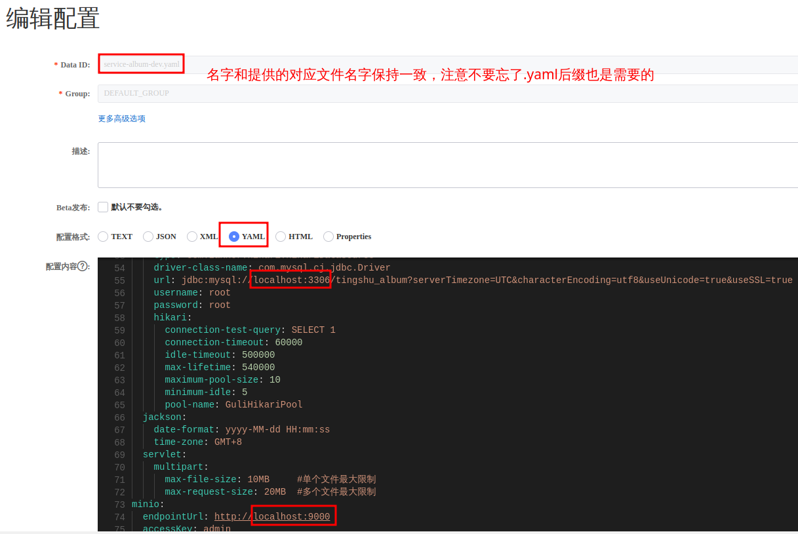
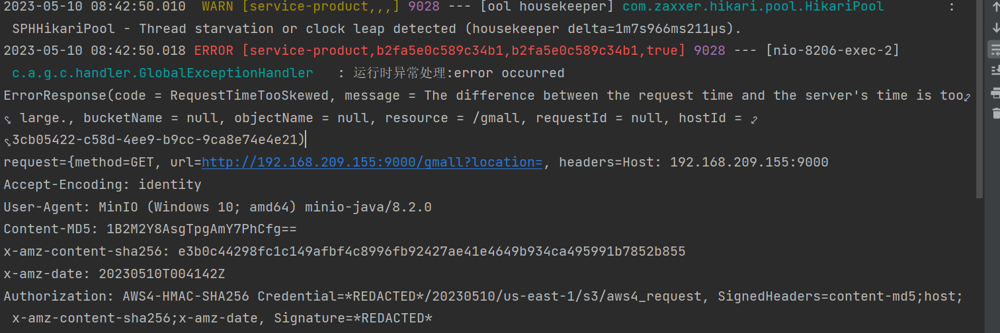

# 专辑管理

## 准备工作

专辑管理对应的模块是service-album，首先我们将application.properties中的nacos配置修改为自己本机的配置。

其次，我们需要访问nacos，增加一个关于service-album和service-gateway的配置，所有模块的配置内容参见`/tingshu-parent/aNacos`目录下
（后续某个模块第一次启动，都需要在nacos中添加对应的配置，你可以在这里一次性将所有配置文件都导入/新建到nacos中）。
同样的，也需要将相关的地址配置等信息修改为自己本机配置。



专辑管理的主要功能如下：

1. 先获取到专辑分类
2. 查询专辑标签
3. 文件上传
4. 保存专辑

功能入口：运行app项目-->我的-->创作中心点击 + 添加专辑


## 查看分类数据

专辑的分类设计是一个三级分类，涉及三个表`base_category1`、`base_category2`、`base_category3`，对于多表查询，通常由我们自己编写SQL执行。
前端需要的分类数据格式如下：
```json
[
  {
    "categoryName":"音乐",                 
    "categoryId":1,                       
    "categoryChild":[
      {
        "categoryName": "音乐音效",
        "categoryId": 101,
        "categoryChild": [
          {
            "categoryName": "催眠音乐",
            "categoryId": 1001
          },
          {
            "categoryName": "放松音乐",
            "categoryId": 1002
          },
          {
            "categoryName": "提神音乐",
            "categoryId": 1003
          }
        ]
      }
    ]
  }
]
```
后端需要得到三张表的数据结果进行处理，那么在MySQL层面，可以实现的方法多种多样，比如子查询，连接查询等。而三张表的数据都需要，因此在这里使用内连接：
```mysql
select 
    t1.id as category1_id, t1.name as category1_name, 
    t2.id as category2_id, t2.name as category2_name,
    t3.id as category3_id, t3.name as category3_name
from tingshu_album.base_category1 t1
inner join tingshu_album.base_category2 t2 on t1.id = t2.category1_id
inner join tingshu_album.base_category3 t3 on t2.id = t3.category2_id
```
还需要考虑的一个问题就是，如果使用上面的SQL语句，那么每次需要获取分类数据的时候，都需要向MySQL发送这个请求，而这毕竟算是一个多表连接的复杂查询，需要消耗较多的资源。
因此我们可以考虑让这个做到`不需要每一次请求分类数据都要执行复杂SQL`，这里我们就可以使用`视图`，将上面SQL执行的结果保存在一个视图中，只有当分类表发生变化才会执行这段复杂SQL。

```mysql
create view base_category_view as
select
    t3.id as id,
    t1.id as category1_id, t1.name as category1_name,
    t2.id as category2_id, t2.name as category2_name,
    t3.id as category3_id, t3.name as category3_name
from tingshu_album.base_category1 t1
         inner join tingshu_album.base_category2 t2 on t1.id = t2.category1_id
         inner join tingshu_album.base_category3 t3 on t2.id = t3.category2_id
```
这样，当我们需要获取分类数据的时候，只需要向视图表中执行一条普通的查询。由于在视图表中，一级分类以及二级分类都不是唯一的记录，只有三级分类是唯一的。
因此，我们只需要将三级分类的id作为视图表的主键id。

数据库层面要做的事情考虑好了，接下来就是在Java层面需要考虑的事情了。
MySQL返回的结果中有大量的一级分类和二级分类的重复，而我们返回给前端的数据中，所有分类都只会出现一次。
从MySQL中获取到的数据类型是`List<BaseCategoryView>`，我们可以对其进行遍历，先根据一级分类进行分组，再根据二级分类进行分组。
要返回上面的JSON格式的数据，就需要考虑后端的返回数据的格式了，毫无疑问，Map是最符合要求的。
综上所诉，对于返回结果的设计是：`以一级分类id作为key,其对应的所有二级分类信息作为value。同时，这个value也是一个Map类型，它的key是二级分类id，value是其对应的所有三级分类信息`。

最终，我们可以得到如下的代码实现：
::: code-group
```java [BaseCategoryApiController]
@Autowired
private BaseCategoryService baseCategoryService;

@GetMapping("/getBaseCategoryList")
public Result getBaseCategoryList() {
    return Result.ok(baseCategoryService.getBaseCategoryList());
}
```
```java [BaseCategoryService]
List<JSONObject> getBaseCategoryList();
```
```java [BaseCategoryServiceImpl]
@Autowired
private BaseCategoryViewMapper baseCategoryViewMapper;

@Override
public List<JSONObject> getBaseCategoryList() {
    // 获取base_category_view视图中所有数据
    List<BaseCategoryView> c1List = baseCategoryViewMapper.selectList(null);
    // 根据一级分类进行分组，以一级分类的id为key
    Map<Long, List<BaseCategoryView>> c1Map = c1List.stream().collect(Collectors.groupingBy(BaseCategoryView::getCategory1Id));
    return c1Map.entrySet().stream().map(c1 -> {
        JSONObject c1Json = new JSONObject();
        c1Json.put("categoryId", c1.getKey());
        List<BaseCategoryView> c2List = c1.getValue();
        c1Json.put("categoryName", c2List.get(0).getCategory1Name());
        // 根据二级分类进行分组，以二级分类的id为key
        Map<Long, List<BaseCategoryView>> c2Map = c2List.stream().collect(Collectors.groupingBy(BaseCategoryView::getCategory2Id));
        List<JSONObject> c2Collect = c2Map.entrySet().stream().map(c2 -> {
            JSONObject c2Json = new JSONObject();
            c2Json.put("categoryId", c2.getKey());
            List<BaseCategoryView> c3List = c2.getValue();
            c2Json.put("categoryName", c3List.get(0).getCategory2Name());
            // 遍历以二级分类为分组的数据，取出其中的三级分类
            List<JSONObject> c3Collect = c3List.stream().map(c3 -> {
                JSONObject c3Json = new JSONObject();
                c3Json.put("categoryId", c3.getCategory3Id());
                c3Json.put("categoryName", c3.getCategory3Name());
                return c3Json;
            }).collect(Collectors.toList());
            c2Json.put("categoryChild", c3Collect);
            return c2Json;
        }).collect(Collectors.toList());
        c1Json.put("categoryChild", c2Collect);
        return c1Json;
    }).collect(Collectors.toList());
}
```
:::


## 文件上传

要实现的功能如图：


我们使用Minio作为图片的存储服务，关于Minio这里不过多赘述，如何使用它的Java SDK参考[官网](https://min.io/docs/minio/linux/developers/minio-drivers.html#java-sdk)

::: tip
文件上传时，需要调整一下linux 服务器的时间与windows 时间一致！



```shell
# 第一步：安装ntp服务
yum -y install ntp
# 第二步：开启开机启动服务
systemctl enable ntpd
# 第三步：启动服务
systemctl start ntpd
# 第四步：更改时区
timedatectl set-timezone Asia/Shanghai
# 第五步：启用ntp同步
timedatectl set-ntp yes
# 第六步：同步时间
ntpq -p
```
:::

要上传图片到Minio，需要使用的MinioClient容器，它提供了putObject方法进行文件上传。

要获取到这个容器，需要传入一些必备参数，比如：Minio服务器地址、身份验证信息、需要操作的bucket。
对于这些信息，我们都存放在nacos的配置文件中，通过MinioConstantProperties来获取。

由于文件上传操作的通用性，在这里将其封装成一个工具类。同时，对于MinioClient，查看它的源码可以发现，它的两个构造器分别是private和protected的。


代码实现：
::: code-group
```java [FileUploadApiController]
@SneakyThrows
@PostMapping("/fileUpload")
public Result fileUpload(MultipartFile file) {
    return Result.ok(fileUtil.upload(file));
}
```
```java [FileUtil]
@Component
public class FileUtil {

    @Autowired
    private MinioConstantProperties minioConstantProperties;

    private MinioClient minioClient;

    @PostConstruct
    public void init() {
        minioClient = MinioClient.builder()
                .endpoint(minioConstantProperties.getEndpointUrl())
                .credentials(minioConstantProperties.getAccessKey(), minioConstantProperties.getSecreKey())
                .build();
    }

    @SneakyThrows
    public String upload(MultipartFile file) {
        String bucketName = minioConstantProperties.getBucketName();
        BucketExistsArgs bucketExistsArgs = BucketExistsArgs.builder().bucket(bucketName).build();
        if (!minioClient.bucketExists(bucketExistsArgs)) {
            MakeBucketArgs makeBucketArgs = MakeBucketArgs.builder().bucket(bucketName).build();
            minioClient.makeBucket(makeBucketArgs);
        }
        String fileName = UUID.randomUUID().toString();
        PutObjectArgs putObjectArgs = PutObjectArgs.builder()
                .bucket(bucketName)
                .object(fileName)
                .contentType(file.getContentType())
                .stream(file.getInputStream(), file.getSize(), -1)
                .build();
        minioClient.putObject(putObjectArgs);
        return minioConstantProperties.getEndpointUrl() + "/" + bucketName + "/" + fileName;
    }
}
```
:::


## 保存专辑

## 查看专辑列表

## 根据Id获删除专辑

## 修改专辑