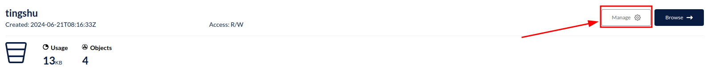
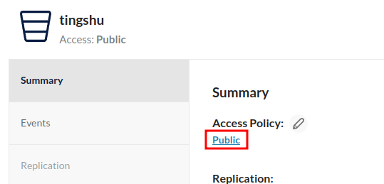
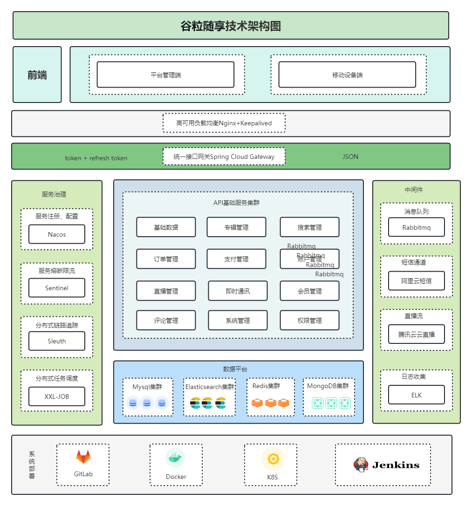

# GettingStart

::: tip
对于基础开发环境，比如MySQL、Redis等等，在这里统一使用Docker容器，并且使用docker-compose进行容器编排。
因此，首先需要具备docker和docker-compose环境，这里不做赘述，详情参考[尚硅谷Docker实战教程](https://www.bilibili.com/video/BV1gr4y1U7CY/?spm_id_from=333.337.search-card.all.click)

当你运行docker-compose文件时，部分镜像可能失效造成容器无法运行，因此你可以将compose文件中的镜像根据需求替换
:::

## Docker容器

### MySQL
使用图形界面工具，执行tingshu.sql即可，里面包含所有的建库建表语句

### RabbitMQ

1. 首先下载rabbitmq_delayed_message_exchange-3.12.0.ez文件上传到RabbitMQ所在服务器，[下载地址](https://www.rabbitmq.com/community-plugins.html)         
2. 切换到插件所在目录，执行`docker cp rabbitmq_delayed_message_exchange-3.12.0.ez ts-rabbitmq:/plugins`命令，将刚插件拷贝到容器内plugins目录下
3. 执行`docker exec -it ts-rabbitmq /bin/bash`命令进入到容器内部
4. 执行`cd plugins`进入plugins目录,然后执行`ls -l|grep delay`命令查看插件是否copy成功
5. 在容器内plugins目录下，执行`rabbitmq-plugins enable rabbitmq_delayed_message_exchange`命令启用插件
6. exit命令退出RabbitMQ容器内部，然后执行`docker restart ts-rabbitmq`命令重启RabbitMQ容器

### Redis
[官网](https://redis.io/docs/latest/operate/oss_and_stack/management/config/)下载对应版本配置文件，修改以下地方（行数可能不一致）：
- 注释87行`bind 127.0.0.1 -::1`
- 111行`protected-mode`修改为yes
- 1036行解开注释，设置密码，比如`requirepass redis`
- 1379行`appendonly`修改为no

### Minio
当实现文件上传接口后，获取返回的图片访问地址，无法访问的原因可能是bucket的权限未开放，默认权限是`private`，将其修改为`public`即可在浏览器输入地址访问图片

## 项目背景
随着智能手机和高速互联网的普及，人们开始寻求更便捷的方式来获取信息和娱乐。有声书的出现使得人们可以在旅途中、跑步时、做家务时等各种场景下，以更加灵活的方式享受阅读。

在过去，有声书主要是由专业的演员朗读，制作成录音带或CD。但随着数字化媒体的发展，听书软件应运而生，为用户提供了更多选择，包括自助出版的有声书和多样化的内容。

意义：

1. 便捷性：听书软件使得阅读不再局限于纸质书籍，用户可以通过手机等设备在任何时间、任何地点收听有声书，节省了携带实体书的麻烦。
2. 多样化内容：听书软件提供了广泛的有声书选择，涵盖了各种类型的图书、小说、杂志、教育内容等。这样的多样性使得用户能够根据个人兴趣和需求选择内容。
3. 阅读体验：通过专业的朗读演员和音效制作，听书软件可以提供更加生动、有趣的阅读体验，有助于吸引更多读者，尤其是那些不太喜欢阅读纸质书籍的人。
4. 辅助功能：听书软件通常还具备一些辅助功能，如调整朗读速度、书签功能、字幕显示等，有助于提高可访问性，使得视力受损或其他障碍的用户也能轻松阅读。
5. 支持作家和内容创作者：听书软件为作家和内容创作者提供了另一种传播作品的渠道，有助于扩大影响力和读者群。
6. 学习工具：听书软件也可以用作学习工具，提供学术教材、外语学习材料等，帮助用户在学习过程中更好地理解和吸收知识。

总的来说，听书软件的开发推动了阅读体验的数字化和个性化，为用户提供了更加便捷、多样化的阅读方式，也促进了作家和内容创作者的创作和传播。

## 项目技术栈

| 技术或工具                                | 描述                                                                                          |
|--------------------------------------|---------------------------------------------------------------------------------------------|
| SpringBoot                           | 简化Spring应用的初始搭建以及开发过程                                                                       |
| SpringCloud                          | 基于Spring Boot实现的云原生应用开发工具；使用的技术包括Spring Cloud Gateway、Spring Cloud Task和Spring Cloud Feign等 |
| MyBatis-Plus                         | 持久层框架，依赖于mybatis                                                                            |
| Redis                                | 内存做缓存                                                                                       |
| Redisson                             | 基于redis的Java驻内存数据网格框架                                                                       |
| MongoDB                              | 分布式文件存储的数据库                                                                                 |
| Rabbitmq                             | 消息中间件；大型分布式项目的标配；分布式事务最终一致性                                                                 |
| ElasticSearch+Kibana+Logstash        | 全文检索服务器+可视化数据监控                                                                             |
| ThreadPoolExecutor+CompletableFuture | 线程池来实现异步操作，提高效率                                                                             |
| xxl-Job                              | 分布式定时任务调用中心                                                                                 |
| Knife4J/YAPI                         | Api接口文档工具                                                                                   |
| MinIO                                | 私有化对象存储集群，分布式文件存储                                                                           |
| 支付平台                                 | 微信支付                                                                                        |
| MySQL                                | 关系型数据库；使用shardingSphere-jdbc进行读写分离、分库分表                                                     |
| Lombok                               | 实体类中生成get/set的jar包                                                                          |
| natapp                               | 内网穿透                                                                                        |
| Docker                               | 容器化技术；在生产环境中用于快速搭建环境，例如使用`Docker run`命令                                                     |
| Git                                  | 代码管理工具；用于拉取代码、提交、推送、合并和解决冲突                                                                 |
| Cannal                               | 阿里开源增量订阅组件，用于数据增量同步                                                                         |
| Seata                                | 阿里开源分布式事务解决方案                                                                               |

前端技术栈
- UniApp
- Vue3全家桶
- TypeScript
- Grace-UI
- Uni-UI
- uniapp-axios-adapter

## 项目架构图

